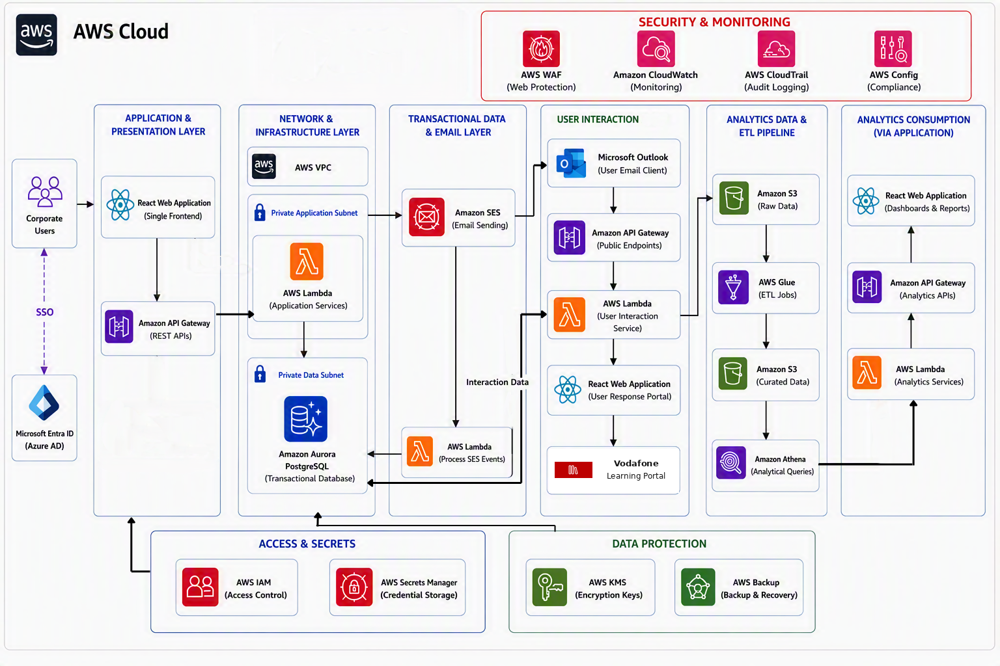
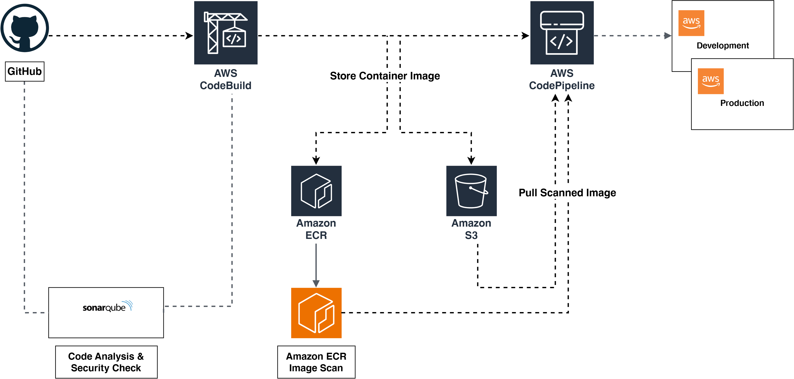

# Security Awareness Platform

[](https://github.com/VOISAwareness/security-awareness-platform/actions/workflows/ci.yml)
[](https://github.com/VOISAwareness/security-awareness-platform/actions/workflows/deploy-lambda.yml)


An enterprise, cloud-native platform for running security awareness programmes:
phishing simulations, training delivery, quiz assessment, risk scoring,
gamification and executive reporting — built on AWS serverless services.

---

## Project status

> **This repository is a working proof of concept, being built out in vertical slices.**
> The two diagrams below describe the **target** architecture. Parts of it are
> live today; parts are not yet built. Every section in this README marks which
> is which, so nothing here should be read as a description of production.

| | State |
|---|---|
| Backend API | **Live** — HTTP API + Python Lambdas + DynamoDB, serving the UI with real data |
| Frontend | **Live locally** — runs via `npm run dev`; there is **no** hosting/deploy pipeline yet |
| Infrastructure | **Partly codified** — Terraform owns tables, bucket and three Lambdas; five Lambdas' config is still click-ops |
| Authentication | **Not implemented** — Entra ID SSO is designed for but deferred; the UI uses a local role picker |
| Email sending | **SES sandbox** — real sends only reach verified identities |
| Analytics pipeline | **Not built** — S3/Glue/Athena layer is design only |

---

## High-Level Architecture



**Figure 1 — Target AWS architecture.**

The diagram shows the intended end state: corporate users authenticating through
Microsoft Entra ID into a React front end, an API Gateway fronting Lambdas in a
private subnet, SES for delivery, a separate user-interaction path for recipients
who click a simulated phish, and an S3 → Glue → Athena analytics pipeline feeding
executive dashboards — wrapped in WAF, IAM, Secrets Manager, KMS, CloudTrail,
CloudWatch, Config and Backup.

### Target vs. what runs today

| Area | Target (Figure 1) | Today |
|---|---|---|
| Database | Amazon Aurora PostgreSQL | **Amazon DynamoDB** — Aurora was dropped; see note below |
| Compute | Lambda in a private VPC subnet | Lambda, **no VPC** (public AWS endpoints, free-tier friendly) |
| API | API Gateway REST | **API Gateway HTTP API (v2)** |
| Auth | Entra ID SSO / OAuth2 / OIDC | **None** — client-side role selection, no tokens |
| Email | SES production | SES **sandbox** |
| Analytics | S3 → Glue → Athena → dashboards | **Not built** |
| Edge security | WAF, Secrets Manager, KMS CMKs, Backup | **Not provisioned** — AWS-owned-key SSE only |

> **Note on the database.** Figure 1 still shows Aurora PostgreSQL. That decision
> was reversed: the platform uses **DynamoDB**, to stay inside the free tier and
> avoid running a VPC and NAT for a POC. Treat DynamoDB as authoritative and the
> Aurora box in the diagram as stale — the diagram is queued for revision.

---

## DevSecOps CI/CD Pipeline



**Figure 2 — Proposed pipeline:** GitHub → SonarQube → CodeBuild → ECR (+ image
scan) / S3 → CodePipeline → Development and Production.

### What actually runs today

Figure 2 is **not yet implemented**. There is no Docker image, no ECR repository,
no CodeBuild project and no CodePipeline. Delivery runs entirely on **GitHub
Actions**, in two workflows:

```
                    ┌──────────────────────────── ci.yml ─────────────────────────────┐
  pull_request  ──► │ backend: ruff lint → py_compile → pytest                        │
  push to main  ──► │ frontend: npm ci → eslint (advisory) → node --test → vite build │
                    └─────────────────────────────────────────────────────────────────┘

                    ┌──────────────────── deploy-lambda.yml ──────────────────────────┐
  push to main      │ OIDC assume-role (no static keys)                                │
  touching          │   → py_compile every backend/*/lambda_function.py                │
  backend/**    ──► │   → zip each function                                            │
                    │   → aws lambda update-function-code  ×5                          │
                    └─────────────────────────────────────────────────────────────────┘
```

Key characteristics of the current pipeline:

- **No static AWS credentials.** `deploy-lambda.yml` assumes
  `GitHubActionsLambdaDeployRole` via GitHub OIDC.
- **CI has no AWS access at all.** Tests must never call AWS; set dummy env
  (including `AWS_DEFAULT_REGION`) before importing a Lambda that builds boto3
  clients at import time.
- **ESLint is advisory** (`continue-on-error: true`) while the prototype's
  ~90 pre-existing errors are cleared. Frontend unit tests are **blocking**.
- **Code only.** The deploy workflow updates function *code*; environment,
  memory, timeout, tables and routes are infrastructure (see below).
- **The frontend is not deployed by anything.** Merging to `main` publishes no
  UI. Running it locally is currently the only way to use the app.

### Proposed pipeline improvements

1. Add static analysis (SonarQube or CodeQL) as a required check.
2. Add a frontend deploy — S3 + CloudFront (or Amplify) — and an environment
   origin in the CORS allowlist to match.
3. Run `terraform plan` on PRs and gate `apply` behind an approval.
4. Promote through Development → SIT → UAT → Production rather than deploying
   straight from `main`.
5. Retire the per-function `update-function-code` steps once all Lambdas are
   Terraform-managed (see below).

---

## Infrastructure as Code — current Terraform architecture

Terraform lives in [`infra/terraform/`](infra/terraform) and targets AWS account
`798299234472` in `ap-south-1`.

```hcl
terraform { required_version = ">= 1.11.0" }

backend "s3" {
  bucket       = "security-awareness-poc-satyajit-2026"
  key          = "terraform/state/poc.tfstate"
  region       = "ap-south-1"
  encrypt      = true
  use_lockfile = true    # S3-native locking — no paid DynamoDB lock table
}
```

Most resources began life as click-ops and were adopted with declarative
`import` blocks in [`imports.tf`](infra/terraform/imports.tf), so Terraform
describes what already exists rather than recreating it.

### The ownership split

This is the single most important rule in the repository:

> **Terraform owns infrastructure. GitHub Actions owns Lambda code.**

Do not add Lambda source zips to Terraform, and do not create or modify tables,
buckets or API routes by hand — change them in `infra/terraform/` and apply.

### What Terraform manages today

| File | Manages |
|---|---|
| `dynamodb.tf` | `campaigns` (GSI `status-index`), `recipients` (GSI `trackingToken-index`), `events` |
| `tables.tf` | 12 reference tables — users, sender-identities, scenarios, landing-pages, user-lists, user-list-members, gamification-rules, training-paths/videos/quizzes/certificates, campaigns-catalog |
| `s3.tf`, `s3_cors.tf` | Assets bucket, AES256 SSE, browser CORS rules for presigned uploads |
| `apigateway.tf` | The HTTP API's **CORS configuration only** |
| `campaigns_api.tf` | `campaigns-api` Lambda + IAM role/policy + integration + 5 routes |
| `reference_api.tf` | `reference-api` Lambda + IAM + integration + 26 routes |
| `recipient_ingest.tf` | `recipient-ingest` Lambda + IAM (S3 → DynamoDB ingest) |

All tables are `PAY_PER_REQUEST` with AWS-owned-key encryption; PITR, TTL and
deletion protection are off, matching the live state at import.

### What Terraform does **not** manage yet

| Outside Terraform | Consequence |
|---|---|
| `campaign-reader`, `email-sender`, `tracking`, `report-event`, `approval` Lambdas | Function config, env vars, memory and timeout are click-ops; only code is deployed, by Actions |
| Routes and integrations for those five functions | The HTTP API's route table is partly click-ops — `apigateway.tf` deliberately manages CORS only |
| SES identities, templates and configuration sets | Managed by hand |
| CloudWatch alarms, log retention, budgets | Not defined |
| IAM roles for the click-ops Lambdas, and `GitHubActionsLambdaDeployRole` | Created by hand |
| Any frontend hosting | Does not exist |

### Proposed Terraform direction

1. **Close the gap** — import the remaining five Lambdas, plus their routes,
   integrations and IAM roles, so one `terraform plan` describes the whole API.
2. **Move the API's routes into code**, replacing the CORS-only resource with a
   full `aws_apigatewayv2_api` definition.
3. **Split state per environment** (`dev`/`sit`/`uat`/`prod`) with a workspace or
   key prefix, instead of the single `poc.tfstate`.
4. **Parameterise the account and prefix** so the stack is reproducible outside
   the POC account, and drop the `import` blocks once state has settled.
5. **Add the operational layer** — log retention, alarms, budget guardrails and
   a frontend hosting stack (S3 + CloudFront + origin in `cors_allowed_origins`).
6. **Adopt KMS CMKs and PITR** when the platform leaves POC status, together with
   WAF and Secrets Manager as Figure 1 intends.

Always `terraform plan` before `apply`, and confirm `0 to destroy` unless a
destroy is genuinely intended.

---

## Technology stack

| Layer | Actually in use |
|---|---|
| Frontend | React 19, Vite 8, Tailwind CSS 3, React Router, Framer Motion, lucide-react — **JavaScript, not TypeScript** |
| Frontend state | React Context (`UserTypeContext`) — no Redux |
| HTTP client | native `fetch` via `src/services/api.js` — no Axios |
| Backend | Python 3.14 AWS Lambda, **stdlib + boto3 only** |
| API | API Gateway **HTTP API (v2)** |
| Data | Amazon DynamoDB (15 tables, on-demand) |
| Storage | Amazon S3 (templates, recipient uploads, Terraform state) |
| Email | Amazon SES (sandbox) |
| IaC | Terraform ≥ 1.11, AWS provider ~> 6.0 |
| CI/CD | GitHub Actions with OIDC |

---

## Data model

Fifteen DynamoDB tables, all prefixed `security-awareness-poc-`:

**Campaign execution** — `campaigns` (PK `campaignId`, GSI `status-index` on
`status`+`createdAt`), `recipients` (PK `campaignId`, SK `recipientId`, GSI
`trackingToken-index`), `events` (PK `campaignId`, SK `eventId`).

**Reference data** — `users`, `sender-identities`, `scenarios`, `landing-pages`,
`user-lists`, `user-list-members`, `gamification-rules`, `training-paths`,
`training-videos`, `training-quizzes`, `training-certificates`,
`campaigns-catalog`.

Canonical field names are **camelCase**. Canonical campaign statuses are the
backend enum:

```
DRAFT → PENDING_APPROVAL → APPROVED → SENDING → SENT
              ↓
           REJECTED                        FAILED
```

The frontend carries some legacy PascalCase names; reconcile them in the
frontend mapping layer (`src/services/campaignStatus.js`), not by rewriting
Lambdas.

---

## API reference

Base URL comes from `VITE_API_BASE_URL`. These are the routes Terraform defines:

**Campaigns** (`campaigns-api`)
```http
GET    /campaigns                  # optional ?status=
POST   /campaigns
GET    /campaigns/{campaignId}
PUT    /campaigns/{campaignId}
DELETE /campaigns/{campaignId}
```

**Workflow transitions** (`approval` Lambda — the sole owner of `status`)
```http
POST /campaigns/{id}/submit
POST /campaigns/{id}/approve
POST /campaigns/{id}/reject      # requires a non-empty comment
```

**Reference data** (`reference-api`)
```http
GET|POST|PUT|DELETE /sender-identities[/{id}]
GET                 /users[/{id}]
GET                 /scenarios[/{id}]
GET|POST|PUT|DELETE /landing-pages[/{id}]
GET                 /user-lists
GET                 /user-lists/{id}/members
PUT|DELETE          /user-lists/{id}
POST                /user-lists/bulk-upload     # returns a presigned S3 PUT URL
POST                /user-lists/{id}/ingest
GET                 /gamification-rules
GET                 /training/paths|videos|quizzes|certificates
GET                 /campaigns-catalog
```

Every Lambda response goes through a `build_response(status, body)` helper that
serialises with a `DecimalEncoder` (DynamoDB numbers → JSON numbers) and sets
`Content-Type: application/json`; CORS headers are added at the API Gateway level.

---

## Repository structure

```text
security-awareness-platform
├── .github/workflows/
│   ├── ci.yml                 # lint + test + build on every push/PR
│   └── deploy-lambda.yml      # OIDC → zip → update-function-code (main only)
├── backend/                   # one directory per Lambda
│   ├── approval/              # campaign workflow state machine
│   ├── campaign-reader/
│   ├── campaigns-api/         # campaign CRUD + list
│   ├── email-sender/          # SES delivery
│   ├── recipient-ingest/      # S3 upload → DynamoDB
│   ├── reference-api/         # reference data + presigned uploads
│   ├── report-event/
│   ├── tracking/              # open/click/compromise tracking
│   ├── seed-data/             # sample S3 payloads
│   └── tests/                 # pytest; must not call AWS
├── docs/
│   ├── architecture.png       # Figure 1 — target architecture
│   └── cicd-pipeline.png      # Figure 2 — proposed pipeline
├── frontend/VShield/          # React 19 + Vite app
│   └── src/
│       ├── Pages/             # Campaigns, Approvals, Scenarios, Training, …
│       ├── GlobalComponents/  # Layout, sidebar, header
│       ├── UserTypeContext/   # role + permission matrix
│       └── services/          # api.js, campaignStatus.js, hooks
├── infra/terraform/           # tables, bucket, HTTP API CORS, 3 Lambdas
├── AGENTS.md                  # conventions and guardrails — read before contributing
├── CONTRIBUTING.md
└── SECURITY.md
```

---

## Local development

### Frontend

```bash
git clone https://github.com/VOISAwareness/security-awareness-platform.git
cd security-awareness-platform/frontend/VShield
npm install
npm run dev
```

Open the app and sign in with any role and the POC password `123456`.

**How API calls are routed.** The HTTP API's CORS allowlist only contains
`http://localhost:5173` and `:5174`, so a browser served from a Codespace or
tunnel hostname would be blocked. `vite.config.js` therefore proxies `/api` to
AWS server-side, and `.env.development` points `VITE_API_BASE_URL` at `/api`.
Requests stay same-origin and CORS never applies, so the app works from
localhost, a Codespace or a tunnel alike. Recipient uploads PUT straight to a
presigned S3 URL, which skips that proxy, so a small dev-only middleware
forwards those too.

Production builds are unaffected — they read the absolute endpoint from `.env`
and PUT directly to S3. If the frontend is ever hosted, **that origin must be
added to `cors_allowed_origins` and applied.**

> Changes to `vite.config.js` are not hot-reloaded. Restart the dev server.

### Backend

```bash
pip install -r backend/requirements-dev.txt
ruff check backend
pytest backend/tests
```

### Infrastructure

```bash
aws sso login --sso-session vshield-sso      # profile: vshield
cd infra/terraform
terraform init
terraform plan                                # confirm 0 to destroy
```

---

## Roles and permissions

Defined in `frontend/VShield/src/UserTypeContext/UserTypeContext.jsx`.
Permissions are snapshotted into `localStorage` at login, so switching roles
requires signing out and back in.

| Role | Access |
|---|---|
| Admin | Everything |
| Campaign Creator | Campaigns, scenarios, training, lists, domains, approvals, analytics |
| Campaign Manager | Same as Campaign Creator |
| Gamification Manager | Gamification engine, analytics, personal pages |
| GMT (Leadership) | Analytics and personal pages |
| Regular User | My Space, My Training |

---

## Learning workflow

```text
Campaign created → user receives simulated phish → user clicks link
        ↓
Training auto-assigned → video watched (no seek-ahead, progress tracked)
        ↓
Completion validated → quiz unlocked → quiz passed
        ↓
Risk score updated → gamification points awarded
```

Video-based learning, unskippable playback, the quiz engine, risk scoring and
gamification are **product design**; the campaign lifecycle, approvals,
scenarios, landing pages and recipient lists are what is built today.

---

## Security posture

**In place**

- No static AWS credentials anywhere — deploys use GitHub OIDC.
- S3 encrypted at rest (AES256); TLS in transit.
- Tracking and `/compromise` endpoints **never store submitted secrets** —
  no passwords, OTPs or card data, in DynamoDB or in logs.
- CORS restricted to the dev origins rather than `*`.
- Structured JSON logging with `aws_request_id`, excluding secrets and full
  tracking tokens.
- `.tfstate`, `.tfplan` and local settings are git-ignored.
- DynamoDB conditional writes for state transitions (optimistic locking).

**Not yet in place** — authentication and authorisation at the API (the API is
currently unauthenticated), WAF, Secrets Manager, KMS CMKs, PITR/Backup,
CloudTrail/Config, and SES production access.

> SES is in sandbox. Never send simulated phishing to real employees from a
> non-production environment; keep a dry-run path.

---

## Contributing

Read [`AGENTS.md`](AGENTS.md) first — it encodes the conventions and guardrails
that keep changes safe. In short:

- Small, reviewable PRs; one concern each.
- Branch → PR → review → merge. Merging to `main` deploys backend code.
- **Rebase or merge `main` into a long-lived branch before merging it.** A branch
  cut from an old base can silently revert work when merged.
- Match existing style: Python is stdlib + boto3 with explicit responses;
  the frontend gets a data layer, not a redesign.
- Never commit secrets, real PII, or AWS keys.

Conventional commits: `feat:`, `fix:`, `docs:`, `refactor:`, `test:`, `chore:`.

---

## Roadmap

**Near term** — Entra ID SSO and API authorisation · frontend hosting and
deploy pipeline · import the remaining Lambdas into Terraform · SES production
access · fix the `TRAINING` nav link (`/training` has no route).

**Then** — the analytics pipeline (S3 → Glue → Athena) · executive dashboards ·
risk scoring engine · certificate generation · per-environment promotion.

**Later** — AI-assisted quiz generation · personalised learning paths · SCORM
support · mobile application · predictive risk analytics.

---

## License

Proprietary. All rights reserved. See [`LICENSE`](LICENSE).
